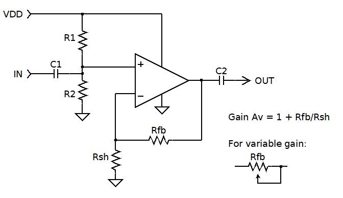

Dia is an open source diagramming tool similar to MS Visio.  It has been stable with only minor developments for a few years, but it is a useful tool for simple 2-D circuit diagrams for discussion and documentation.  There are prebuilt versions for Windows and Linux. See:
- Latest 0.97.3 build <https://github.com/GNOME/dia/tree/master>  
- Older documentation and 0.97.2 builds for Windows, Mac and Linux <http://dia-installer.de/>

A set of custom shapes I've developed is maintained in a public repo:  
<https://github.com/shumphreys2/SRH_circuit_shapes>

Here's an example schematic:  
  
  
  
  
    
  
  
